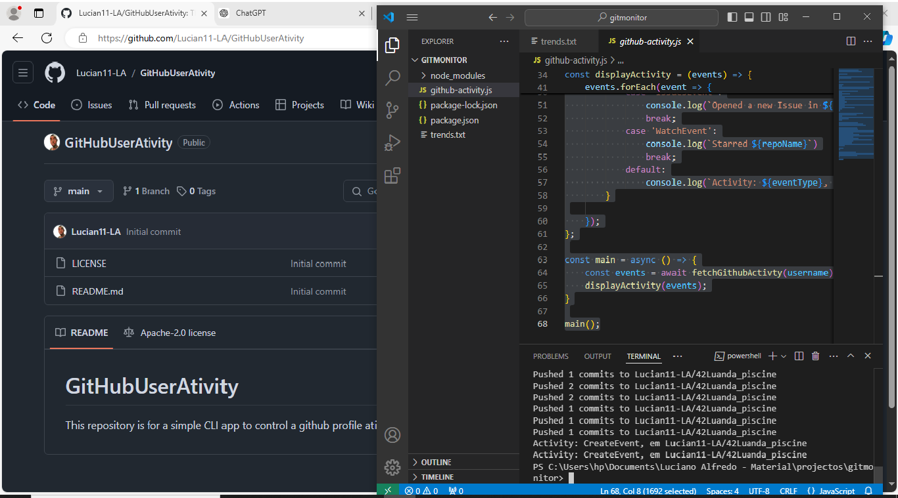

# GitHubUserAtivity
<h1>This repository is for a simple CLI app to control a github profile ativity</h1>

Este projecto e bastante simples de se fazer e entender, basta ter o minimo conhecimento de javascript e node js para perceber.
O script é uma ferramenta de linha de comando que permite a um usuário consultar e exibir atividades recentes de um perfil do GitHub. Ele faz uma requisição à API do GitHub para obter 

eventos recentes de um usuário e os exibe de forma compreensível, categorizando por tipo de evento.

<h2>Fiz o uso de: </h2>
<ul>
  <li><h3>Documentacao da api do github</h3></li>
  <li>Nodejs</h3></li>
  <li><h3>Biblioteca Axios</h3></li>
</ul>
Eu fiz esse script usando javascript e a biblioteca axios. A biblioteca serve para trabalhar as requisiçoes na api  do Github.

